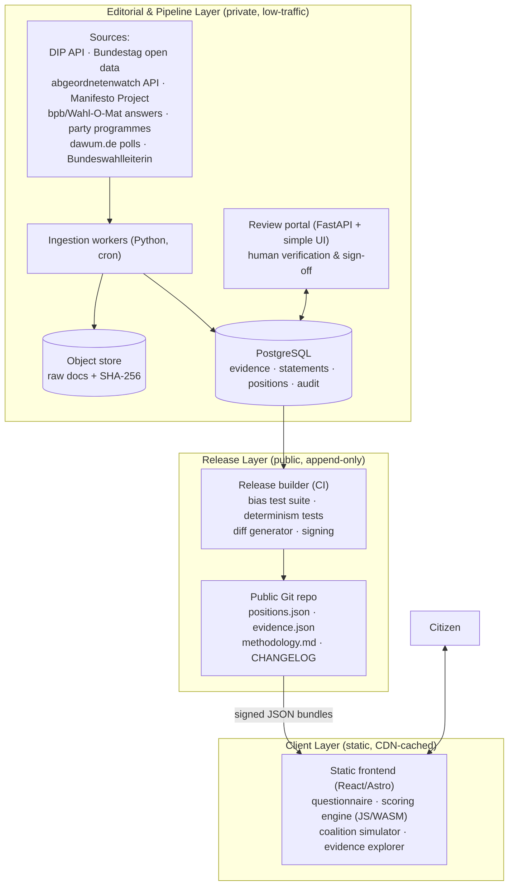

# Wahlkompass — Consolidated Technical Design (v1.1, Model-Review Edition)

**Version:** 1.1 consolidated · **Scope:** Germany first (Bundestag, then Länder), country-agnostic core · **Status:** Design for adversarial review
**Provenance:** v1.0 architecture + v1.1 amendments merged into one self-contained document. No external references required.

## Briefing for the reviewing model

You are receiving this for adversarial technical review. Useful critique: gaps in the math, attack vectors on the release/signing chain, failure modes in the evidence pipeline, schema problems, cheaper or simpler ways to achieve the same guarantees, and anything a hostile party's lawyer or a motivated troll would exploit. Please anchor claims to specific sections.

Constraints that are decisions, not oversights — arguing against them requires engaging the stated rationale, not restating the feature: **D1–D6 below**, especially D6 (no predictive features: no delivery index, no coalition-formation probabilities, no scenario forecasting — a prior review proposed these; §0 and the roadmap explain the rejection), the absence of a graph database in the serving path (§5), the absence of news-sentiment inputs (§2.4), and client-side scoring with no server-side user data (D3). A review that scores this highly and then proposes features violating these constraints will be treated as not having read them.

---

## 0. Design Position

The two reviewed specs shared one structural flaw: they spent their depth on infrastructure (easy, low-risk) and hand-waved position derivation and scoring (hard, where every real-world controversy lives). This design inverts that. Roughly 60% of this document covers how a number gets attached to a party, who can challenge it, and how the pipeline proves it treated everyone identically. The infrastructure section is short because the architecture makes most infrastructure unnecessary.

Five decisions define the design. Everything else follows from them.

**D1 — Score concrete statements, not abstract categories.** Both prior specs modeled parties as vectors over 100–200 abstract issue categories ("Environment → Energy → Renewables"). Abstract categories force interpretive judgment at scoring time, which is where bias enters, and they spread evidence too thin (200 categories × 20 parties = 4,000 cells to defend). Instead, the unit of scoring is a **concrete, decided policy statement** — e.g. *"Die Schuldenbremse im Grundgesetz soll reformiert werden, um höhere Investitionen zu ermöglichen."* Germany's Wahl-O-Mat has validated this model for 20+ years with 38 theses. Roughly 30–40 statements per election. Every statement must satisfy an evidentiary admission test: at least one Bundestag roll-call vote, government bill, or formal party programme position must exist for a majority of covered parties. If a statement can't be evidenced, it doesn't ship — no matter how interesting it is.

**D2 — Evidence-derived positions, with party self-declaration shown side by side.** Wahl-O-Mat's weakness is that parties self-report their answers, so answers cost nothing. This platform derives each party's position from a tiered evidence record (roll-call votes strongest), *and* records the party's self-declared answer where one exists. When they diverge, the divergence is displayed: "Says: agree. Voted: against, 3 of 3 times." That gap is the platform's signature feature and its strongest neutrality proof — it embarrasses every party equally, mechanically.

**D3 — Client-side scoring against signed static data releases.** The user's answers are political opinions — GDPR Art. 9 special-category data. The only architecture that fully solves this doesn't collect them: party positions ship as a versioned, cryptographically signed JSON bundle; the match computation runs entirely in the browser. No accounts, no sessions, no server-side preference table. Side effects: the "identical calculation for every user" claim becomes verifiable by anyone reading the frontend source; election-night scaling becomes a CDN cache problem instead of a Kubernetes problem; and monthly infrastructure cost drops to double digits.

**D4 — Deterministic scoring path, forever.** ML may assist the *editorial pipeline* (retrieving candidate evidence for human review). It never touches the scoring path, position values, or user-facing text generation in v1. This is a neutrality decision and a regulatory one (§8, EU AI Act).

**D5 — Data releases, not a live database.** Positions change through **releases** (like software): `data-release 2026.09.1` with a changelog, a diff against the previous release, evidence deltas, and a signature. Disputes, corrections, and party objections are handled through the release process with a public trail. There is no path by which a position changes in production silently.

**D6 — Descriptive, never predictive.** No feature may output a probability, likelihood, expectation, or timeline about future political behavior — coalition-formation odds, pledge-delivery probability, legislative timelines, ministry allocation. Every prediction requires judgment calls with no mechanical anchor, and every wrong forecast becomes evidence of partisanship. Backward-looking measurement from T1/T2 documents ("this pledge entered the Koalitionsvertrag and became law on date X") is permitted; anything with a future tense is not. This rejects, by name: a Delivery Index, coalition-probability scoring, ministry-allocation simulation, and free-form scenario analysis. The permitted descriptive slice ships as the Koalitionsvertrag-Tracker (Phase 6): a per-pledge ledger with outcome documents and dates — no headline fulfillment percentage, because a single number smuggles the judgment calls back in.

---

## 1. System Overview



Three layers, three trust models. The **editorial layer** is private and slow; it is where judgment lives, and every judgment is logged. The **release layer** is the public, append-only artifact trail; it is where accountability lives. The **client layer** is static and stateless; it is where the user lives, and nothing about the user ever leaves it.

There is no public API server in v1. The public product is a static site plus downloadable signed data. (A read-only JSON API for researchers is a Phase 4 addition, trivially served from the same static files.)

---

## 2. Scoring Specification (complete, no placeholders)

### 2.1 User input

For each statement *i* in the active statement set, the user provides:

- a stance **uᵢ ∈ {−1, −0.5, 0, +0.5, +1}** (five labeled positions: lehne stark ab / lehne ab / neutral / stimme zu / stimme stark zu), or **skip**;
- a weight **wᵢ ∈ {1, 2}** ("doppelt gewichten"), default 1.

Internally the engine is continuous (uᵢ ∈ [−1,1], wᵢ ∈ (0,1]); the UI discretizes for usability. Let **A** be the set of answered (non-skipped) statements. Skipped statements are excluded from both numerator and denominator — they are *never* imputed as 0, defaulted to "supportive," or otherwise invented. If |A| < 10, the engine displays results with a prominent low-coverage warning and refuses to display a ranked list (unranked cards only).

### 2.2 Party match score

Party *P* has, per statement, a derived position **pᵢ ∈ [−1, 1]** and confidence **cᵢ ∈ [0, 1]** (derivation in §3). The match score is a normalized weighted L1 similarity:

```
            Σ_{i∈A}  wᵢ · |uᵢ − pᵢ|
S(P) = 1 −  ───────────────────────          ∈ [0, 1],  displayed as 0–100%
            2 · Σ_{i∈A}  wᵢ
```

The constant 2 is the maximum per-statement disagreement (|+1 − (−1)|). Properties worth stating because they are the neutrality guarantees: the formula is symmetric in parties (no party-specific terms), monotone (moving a party's position toward the user never lowers its score), scale-fixed (no learned parameters), and total — it is the *only* computation between user input and ranking. There is no fallback formula, no "if the user didn't specify, assume…" branch. Document 2's default-to-maximally-supportive shortcut is exactly the kind of branch this spec prohibits.

### 2.3 Match confidence interval

Positions carry uncertainty; the display must too. Per party:

```
CI(P) = Σ_{i∈A} wᵢ·cᵢ / Σ_{i∈A} wᵢ                     (mean evidence confidence, 0–1)

Half-width: h(P) = (1 − CI(P)) · Σ_{i∈A} wᵢ·(1−cᵢ)·1 / (2·Σ_{i∈A} wᵢ)
```

Practically: each low-confidence position contributes its maximum possible score movement, discounted by confidence. Display: **"Übereinstimmung: 71% (±6)"**. Ranking ties within overlapping intervals are displayed as ties (shared rank), not resolved arbitrarily — arbitrary tie-breaking between parties is a bias vector.

### 2.4 What is deliberately *not* in the score

- **Salience.** A party may agree with the user and not care about the issue. Salience (share of manifesto/parliamentary attention) is computed and *displayed* per statement ("Für Partei X ist dieses Thema: zentral / randständig"), but never multiplied into S(P). Mixing direction and salience in one scalar is unexplainable and unauditable.
- **Polling.** Electability is a coalition-simulator input (§4), not a match input. "You match party X but they'll poll 3%" is information for the user to weigh, not for the algorithm to pre-weigh.
- **News sentiment.** Media tone is itself partisan-distributed; feeding it into positions launders media bias into "data." Excluded from the scoring path permanently, not just v1.

---

## 3. Position Derivation — the core of the platform

This is the section both reviewed documents skipped. It is the whole game.

### 3.1 Evidence model

Every position pᵢ for party P is computed from an explicit set of **evidence items**. An evidence item is a tuple:

```
(party, statement, source_tier, direction x ∈ [−1,1], date, document_ref, extract, reviewer_signoff)
```

`document_ref` points to an immutable raw document in the object store (SHA-256 recorded); `extract` is the specific passage/vote that justifies the direction. Every evidence item is individually visible to end users — click any position, see every document behind it.

### 3.2 Evidence tiers (Germany)

| Tier | τ (weight) | Source | What it proves |
|---|---|---|---|
| T1 — Revealed behavior | 1.0 | Namentliche Abstimmungen (Bundestag roll-call votes, open XML on bundestag.de); Fraktion bill sponsorship & Anträge via DIP API (dip.bundestag.de); Bundesrat votes of party-led Länder | What the party *did* with actual power |
| T2 — Formal self-declaration | 0.8 | Wahl-O-Mat party answers incl. Begründungen (published by bpb); official Wahlprogramm passages; Grundsatzprogramm; coalition agreements signed | What the party *committed to in writing* |
| T3 — Expert-coded programme data | 0.6 | Manifesto Project (WZB Berlin) coded quasi-sentences; abgeordnetenwatch.de candidate/party survey responses | Third-party structured coding |
| T4 — Attributed public statements | 0.3 | Party press releases; speeches by party leadership in Plenarprotokoll | Weakest; capped: T4 alone can never establish a position (see admission rule) |

Direction coding per item: roll-call votes map mechanically (Ja on a statement-aligned bill → +1; Nein → −1; Enthaltung → 0 with reduced item weight 0.5; absence → excluded). T2/T3/T4 items get a direction assigned by a **paired-reviewer process**: two reviewers code independently on the 5-point scale; disagreement > 0.5 escalates to the methodology board (§3.6). Both codings and the resolution are stored.

**Admission rule:** a position ships only if it is supported by ≥1 item of tier T1 or T2, or ≥3 concordant T3 items. Otherwise the party's cell for that statement is **"keine belegbare Position"** — displayed as such, excluded from that user-statement pairing exactly like a user skip (removed from numerator and denominator for that party). No position is ever guessed. This is how small and new parties are handled honestly: sparse evidence produces narrow coverage and wide intervals, not fabricated centrism.

### 3.3 Aggregation formula

With evidence items e = (τₑ, xₑ, tₑ) for cell (P, i), and recency decay with half-life of one legislative period:

```
ρ(e) = exp(−λ · age_years(e)),   λ = ln(2)/4  ≈ 0.173

        Σₑ τₑ · ρ(e) · xₑ
pᵢ  =  ───────────────────
        Σₑ τₑ · ρ(e)
```

**Legislature-boundary rule:** T1 evidence older than two legislative periods is dropped entirely (parties are allowed to change), *except* when the party has publicly reaffirmed the old position — then the reaffirmation is the (T2, fresh) evidence.

### 3.4 Confidence formula

```
volume    v = 1 − exp(−W / W₀),      W = Σₑ τₑ·ρ(e),   W₀ = 1.5  (≈ saturates after ~2 strong items)
agreement a = 1 − σ_w(x) / σ_max,    σ_w = weighted std of item directions, σ_max = 1
cᵢ = v · a
```

A party that voted three times the same way on fresh bills: c ≈ 0.95. A party with one old manifesto sentence: c ≈ 0.35. A party whose votes contradict its programme: agreement term collapses, c drops, *and* the divergence display (§3.5) activates. All constants (τ tiers, λ, W₀) are published in `methodology.md`, versioned, and changeable only through a public methodology release — never per-party, never per-release quietly.

### 3.5 The divergence view (Sagen vs. Tun)

For each (party, statement) cell, compute the T2-only position (what they say) and the T1-only position (what they did). If |p_T2 − p_T1| > 0.5 with both sides admissible, the cell is flagged **divergent** and the UI shows both values with their evidence side by side. The composite pᵢ (used for scoring) remains the tier-weighted blend — T1's higher τ means actions already dominate words. The flag is presentation, not a scoring modifier; the same rule fires for every party, mechanically. Expect this to be the most-cited feature of the platform and the most-attacked; its defense is that the rule contains no party name.

### 3.6 Editorial governance

- **Statement selection.** A statement committee drafts candidates against the admission test (D1). Final set balance is checked against a published topic rubric (economy/social/climate/migration/security/digital/Europe/institutions), and the *selection itself* is the platform's largest residual bias surface — acknowledged in methodology.md rather than hidden. Mitigation: publish the rejected-statement list with rejection reasons.
- **Methodology board.** 5–7 members: political scientists (e.g. Manifesto Project–adjacent academics), a statistician, a legal advisor; publicly named; balanced by documented rule (no two members with the same party membership; disclosure of memberships required). The board resolves coding escalations and owns methodology releases.
- **Party right of reply.** 14 days before each data release, every covered party receives its full position sheet with evidence. Objections must cite evidence (a document, a vote) — "we don't like the score" is not an objection. Every objection and its resolution is published in the release notes. This mirrors the procedural legitimacy that has protected Wahl-O-Mat, while keeping final authority with the evidence rules rather than the parties.
- **Equal treatment of all ballot-admitted parties.** Coverage includes every party admitted by the Bundeswahlausschuss, not just Bundestag parties — the 2019 Volt litigation against Wahl-O-Mat's 8-party comparison limit is the controlling cautionary precedent. The UI compares the user against *all* parties simultaneously. This explicitly includes parties the operator may find repugnant; the neutrality claim is only worth anything if it holds there. Sparse-evidence handling (§3.2) does the honest work.

---

## 4. Coalition Simulator (Germany-specific)

Germany is the coalition country; a party match without coalition context misleads. The simulator answers: *given current polling, which governments are arithmetically and politically feasible, and how well does each match you?*

### 4.1 Inputs

- Seat projection from poll aggregation: dawum.de API (open, aggregates all major German pollsters), converted to seats under current electoral law — **630 seats, majority 316**, 5% Sperrklausel with Grundmandatsklausel as restored by the BVerfG's July 2024 ruling on the 2023 reform. The seat-projection code is a pure function, unit-tested against published projections.
- Party position vectors from the current data release.
- **Exclusion matrix E**: declared, sourced incompatibilities — e.g. the CDU Unvereinbarkeitsbeschluss (no cooperation with AfD or Linke), and all parties' declared refusals regarding AfD. Every matrix entry carries a T2 document reference and a date; exclusions expire from the matrix if not reaffirmed each legislative period. The matrix is data, not code — it ships in the release and is disputable through the same right-of-reply process.

### 4.2 Feasibility filter

Enumerate coalitions C (party subsets, |C| ≤ 4): feasible iff seats(C) ≥ 316, minimal (no member removable while retaining majority), and no pair in C appears in E. CDU/CSU are modeled as one Fraktion for coalition arithmetic but as two parties for positions (CSU positions derive from CSU evidence — they diverge measurably on migration and Europe).

### 4.3 Coalition position and cohesion

```
p_{C,i} = Σ_{P∈C} s_P · p_{P,i} / Σ_{P∈C} s_P                    (seat-weighted stance)

Ω(C)    = 1 − Σ_{i∈A} wᵢ · σ_C(i) / Σ_{i∈A} wᵢ                   (cohesion on the user's issues)
          where σ_C(i) = seat-weighted std of member positions on i, normalized by max std (=1)
```

No "friction coefficient." Document 1's undefined friction term was an editorial dial hidden inside math; here internal conflict is *reported* (Ω, plus the top-3 highest-variance statements per coalition: "Diese Koalition ist sich uneinig bei: …") rather than silently baked into the stance. The user sees S(C) computed exactly like S(P) against p_C, alongside Ω(C) and seat margin. Interpretation is theirs.

### 4.4 What the simulator refuses to do

It does not predict which coalition *will* form (that's punditry), does not apply popularity weighting to the match, and does not rank coalitions by anything other than the user's own match score. Feasibility is binary and sourced; everything else is display.

---

## 5. Data Model

PostgreSQL only. No graph database — the traversals here (party→evidence→document, statement→votes) are two-join queries; Neo4j earns a place only if Phase 5+ network research (co-sponsorship influence graphs) materializes, and even then as an analytical sidecar, never in the serving path. No OpenSearch — full-text search over a few thousand documents is Postgres `tsvector` territory (German dictionary: `to_tsvector('german', …)`). No Redis — nothing hot exists server-side.

```sql
-- v1.1: country-agnostic core. The scoring methodology ports across jurisdictions;
-- the evidence source mapping does not (see §6) — schema neutrality is necessary, not sufficient.
CREATE TABLE country (
    code          CHAR(3) PRIMARY KEY,           -- ISO 3166-1 alpha-3: DEU, KEN, NLD ...
    name          TEXT NOT NULL
);

CREATE TABLE legislature (
    id            SERIAL PRIMARY KEY,
    country_code  CHAR(3) NOT NULL REFERENCES country(code),
    name          TEXT NOT NULL,                 -- Bundestag, Landtag NRW ...
    level         TEXT NOT NULL,                 -- national | regional
    seats         INT NOT NULL,
    majority      INT NOT NULL
);

-- v1.1: persistent policy objects ABOVE statements. Navigation, evidence reuse, and
-- backward-looking longitudinal display only. Scoring never touches this table (D1 unchanged).
CREATE TABLE policy (
    id            SERIAL PRIMARY KEY,
    slug          TEXT NOT NULL UNIQUE,          -- 'nuclear-energy-de'
    name_de       TEXT NOT NULL,
    aliases       TEXT[],
    topic         TEXT NOT NULL
);

CREATE TABLE party (
    id            SERIAL PRIMARY KEY,
    name          TEXT NOT NULL,
    short_name    TEXT NOT NULL,
    level         TEXT NOT NULL DEFAULT 'federal',      -- federal | land:BY | ...
    ballot_status TEXT NOT NULL,                        -- admitted | parliamentary | historical
    UNIQUE (short_name, level)
);

CREATE TABLE statement (
    id            SERIAL PRIMARY KEY,
    election_id   INT NOT NULL REFERENCES election(id),
    policy_id     INT REFERENCES policy(id),           -- v1.1
    text_de       TEXT NOT NULL,
    text_easy_de  TEXT,                                  -- Leichte Sprache version
    topic         TEXT NOT NULL,                         -- rubric bucket, for balance audit
    admission_ref TEXT NOT NULL,                          -- why this statement passed the evidence test
    status        TEXT NOT NULL DEFAULT 'draft'          -- draft | approved | retired
);

CREATE TABLE raw_document (
    id            SERIAL PRIMARY KEY,
    source        TEXT NOT NULL,                         -- dip | bundestag_xml | bpb | manifesto | ...
    url           TEXT,
    object_key    TEXT NOT NULL,                         -- object-store path
    sha256        CHAR(64) NOT NULL UNIQUE,
    fetched_at    TIMESTAMPTZ NOT NULL DEFAULT now()
);

CREATE TABLE evidence_item (
    id            SERIAL PRIMARY KEY,
    party_id      INT NOT NULL REFERENCES party(id),
    statement_id  INT NOT NULL REFERENCES statement(id),
    document_id   INT NOT NULL REFERENCES raw_document(id),
    tier          SMALLINT NOT NULL CHECK (tier BETWEEN 1 AND 4),
    direction     NUMERIC(3,2) NOT NULL CHECK (direction BETWEEN -1 AND 1),
    item_weight   NUMERIC(3,2) NOT NULL DEFAULT 1.0,     -- e.g. 0.5 for Enthaltung
    evidence_date DATE NOT NULL,
    extract       TEXT NOT NULL,                         -- the passage / vote record
    coder_a       TEXT NOT NULL,
    coder_b       TEXT,                                  -- null for mechanical T1 mapping
    resolution    TEXT,                                  -- board resolution if coders diverged
    verified      BOOLEAN NOT NULL DEFAULT FALSE
);
CREATE INDEX idx_evidence_cell ON evidence_item(party_id, statement_id) WHERE verified;

CREATE TABLE position_snapshot (                          -- materialized per release, never mutated
    release_tag   TEXT NOT NULL,
    party_id      INT NOT NULL REFERENCES party(id),
    statement_id  INT NOT NULL REFERENCES statement(id),
    p             NUMERIC(4,3),                           -- NULL = keine belegbare Position
    confidence    NUMERIC(3,2),
    p_said        NUMERIC(4,3),                           -- T2-only (divergence view)
    p_did         NUMERIC(4,3),                           -- T1-only
    divergent     BOOLEAN NOT NULL DEFAULT FALSE,
    PRIMARY KEY (release_tag, party_id, statement_id)
);

CREATE TABLE audit_log (                                  -- append-only; trigger blocks UPDATE/DELETE
    id            BIGSERIAL PRIMARY KEY,
    actor         TEXT NOT NULL,
    action        TEXT NOT NULL,
    entity        TEXT NOT NULL,
    detail        JSONB NOT NULL,
    at            TIMESTAMPTZ NOT NULL DEFAULT now()
);
```

Note what is absent: any table containing user answers, sessions, or preferences. That absence is the privacy architecture.

---

## 6. Ingestion Pipeline (Germany sources, concrete)

| Source | Access | Cadence | Feeds |
|---|---|---|---|
| DIP (dip.bundestag.de) | REST API, free key | nightly | bills, Anträge, Drucksachen metadata (T1) |
| Bundestag open data | XML dumps, no auth | nightly | namentliche Abstimmungen with per-MdB votes (T1) |
| abgeordnetenwatch.de | open REST API v2 | weekly | party/candidate survey positions, vote records cross-check (T3) |
| bpb / Wahl-O-Mat | published thesis+answer sets per election | per election | party self-declarations with Begründungen (T2) |
| Manifesto Project (WZB) | dataset + API, free registration | per release | coded programme quasi-sentences (T3) |
| Party websites | scrape, PDF | per election + on publication | Wahlprogramme, Grundsatzprogramme, Beschlüsse (T2) |
| dawum.de | open JSON API | daily | poll aggregation → seat projection (simulator only) |
| Bundeswahlleiterin | CSV/open data | per election | official results, ballot-admitted party list |

Pipeline shape: `fetch → hash → store raw → parse (deterministic per source) → propose evidence items → human review portal → verified evidence → release builder`. T1 vote mapping is mechanical (bill ↔ statement links are the human judgment, made once per bill, dual-coded). Roll-call XML parsing is fully deterministic. **v1.1 — per-legislature evidence configuration.** The tier table above is Germany-Bundestag config, not a global constant. Which sources exist at which tier, access methods, and coverage caveats live in `evidence_config/{legislature}.yaml`, board-reviewed per jurisdiction. Germany's T1 rests on namentliche Abstimmungen, which cover only a fraction of Bundestag votes; other parliaments differ more. "Country = X plugs in" is true for the schema and false for the editorial work.

**v1.1 — pipeline-AI scope, expanded and fenced.** Permitted LLM/ML uses inside the editorial pipeline, all human-gated: candidate-passage retrieval, entity extraction and linking, duplicate detection, coder-facing bill summaries, translation drafts for future jurisdictions, semantic search inside the review portal. Two hard fences: (1) no model output ever becomes an evidence item, direction value, or position without dual human sign-off; (2) no LLM-generated user-facing text without named human editorial sign-off and on-page labeling — violating this collapses the §8 AI-Act posture and is a release-blocking defect. Within that scope: an LLM may be used in exactly one v1 pipeline slot from Phase 3: *retrieving candidate passages* from long programme PDFs for human coders — a recall aid whose output never becomes evidence without dual human sign-off. Licensing note for the build: bpb publishes party answers for public information purposes and Manifesto Project data carries academic-use terms — confirm redistribution rights for both before the evidence explorer republishes extracts verbatim (extracts may need to be quotation-length with links out).

---

## 7. Release & Verification Layer

Each data release is a Git tag in a public repository containing:

```
positions.json        # per-party per-statement: p, confidence, p_said, p_did, divergent
evidence.json         # every evidence item: tier, direction, date, sha256, source URL, extract ref
statements.json       # texts, topics, admission refs
exclusions.json       # coalition exclusion matrix with document refs
methodology_version   # pins τ, λ, W₀, formulas
CHANGELOG.md          # human-readable: what changed, why, incl. party objections & resolutions
diff/                 # machine diff vs previous release
release.sig           # minisign/sigstore signature over the bundle
```

The frontend fetches the bundle, verifies the signature in-browser, and pins the release tag in the UI footer ("Datenstand: 2026.09.1"). Anyone can: reproduce positions.json from evidence.json using the published formulas (a `reproduce.py` ships in the repo); diff releases; or run the frontend against an old release. Silent revision is structurally impossible, which is a stronger claim than "we have an audit log."

---

## 8. Legal & Regulatory Posture (Germany/EU)

Flag: this section is design-level analysis, not legal advice — a German media/data lawyer reviews before launch.

- **GDPR.** Client-side scoring means no Art. 9 processing of user political opinions occurs server-side at all. Remaining processing: standard web-server logs (minimize, IP truncation) and — if any analytics — aggregate-only, self-hosted, no per-answer events. The DPIA becomes short because the honest answer to "what user data do you process?" is "none of substance."
- **EU AI Act.** Annex III designates AI systems intended to influence election outcomes or voting behavior as high-risk. The core engine is a published deterministic formula with no learned components — designed to fall outside the Act's AI-system definition (Art. 3(1) "infers… how to generate outputs") and, independently, to be defensible as descriptive information rather than influence-targeting. The moment an LLM writes user-facing text or a model shapes rankings, that analysis changes; hence D4. The Phase-3 pipeline LLM (internal recall aid, human-gated) sits in a different, low-risk posture — still document it.
- **Wahl-O-Mat case law.** The 2019 Volt proceedings established that unequal comparative presentation of parties is attackable (Chancengleichheit, Art. 21 GG context). Design consequences already embedded: all ballot-admitted parties, simultaneous comparison, identical rules, published methodology, right of reply.
- **DSA / MStV.** No user-generated content, no recommender over third-party content in the DSA sense; likely outside DSA platform duties at any realistic scale. Medienstaatsvertrag transparency duties for media intermediaries are a possible edge — the published-methodology posture over-satisfies them anyway.
- **Operator structure.** Neutrality is also institutional: a gGmbH or Verein with published funding, no party donations accepted, board disclosure rules (§3.6). Wahl-O-Mat survives attacks partly because bpb's institutional design absorbs them; a private platform needs its equivalent in bylaws.

---

## 9. Bias & Integrity Test Suite (runs in CI, blocks every release)

1. **Determinism / golden files.** Fixed synthetic user set × release data → byte-identical scores across runs and platforms. Any diff blocks release.
2. **Party-symmetry test.** Permute party labels on synthetic data → rankings permute identically. Proves no party-name-dependent code path exists.
3. **Mirror test.** User vector u vs −u against a mirrored party set → mirrored rankings.
4. **No-imputation assertion.** Engine throws on any NULL position entering a score; grep-level CI check that no default-value branch exists in the scoring module.
5. **Coverage-parity report.** Evidence weight W per party per statement, published in release notes; parties below admission thresholds are listed with their "keine belegbare Position" counts — visible, not hidden. A widening coverage gap between similar-sized parties triggers board review.
6. **Statement-balance report.** Topic-rubric distribution of the statement set + a spread metric: for each statement, the variance of party positions (statements where all parties agree are dead weight; a set where disagreement systematically isolates one party is flagged for board review — that pattern can be legitimate or can be selection bias, and a human must decide which, on the record).
7. **Divergence-symmetry audit.** Distribution of divergence flags across parties, published. The rule is mechanical; the audit proves it.

---

## 10. Frontend

Static site (Astro or React, Tailwind), German-first with Leichte Sprache toggle (statement texts get a plain-language version — participation is the point). Screens: **Fragebogen** (30–40 statements, 5-point + skip + double-weight, progress-saving in localStorage only, with an explicit "runs on your device, nothing is sent" note), **Ergebnis** (all parties, score ± interval, tied ranks shown as ties), **Beleg-Explorer** (tap any cell → every evidence item → source document), **Sagen-vs-Tun** view, **Koalitionssimulator** (feasible coalitions, match, cohesion Ω, top disagreements), and **Methodik** (formulas rendered, constants, release changelog, reproduce instructions). Scoring engine as a small pure TypeScript module (~200 lines including tests) — auditable by reading it, which is the point. WASM only if statement counts ever make it necessary (they won't).

Accessibility target WCAG 2.1 AA; election tools have a legal and moral floor here.

---

## 11. Infrastructure & Cost

| Component | Choice | Monthly |
|---|---|---|
| Frontend + data bundles | Cloudflare Pages / R2 (static, CDN-cached) | €0–5 |
| Editorial: Postgres + FastAPI portal + workers | 1× Hetzner CX32 (or George's existing infra patterns: Docker Compose) | €15 |
| Object store (raw docs) | Hetzner Object Storage / R2 | €5 |
| CI (tests, release builder) | GitHub Actions free tier | €0 |
| Domain, signing, misc | | €5 |
| **Total** | | **≈ €25–30 / month** |

Election-night load hits only static CDN assets; the editorial server can be *off* on election night and the product works. Compare: document 1 budgeted $2,800/month for a Kubernetes cluster to survive the traffic its own architecture created. The scaling section of this spec is this paragraph.

---

## 12. Roadmap

| Phase | Duration | Deliverable | Exit criterion |
|---|---|---|---|
| 0 — Charter | 4 wks | Methodology v1 published; board recruited; legal review; operator entity | Methodology survives external academic review |
| 1 — Evidence foundation | 8–10 wks | 30 statements for the sitting Bundestag; T1 pipeline (DIP + roll-call XML) live; review portal; ≥85% cells admissible for parliamentary parties | Reproducible release 0.1 from real evidence |
| 2 — Public launch | 6 wks | Static frontend + scoring engine + evidence explorer; signed release 1.0; bias suite in CI | External party can reproduce positions.json |
| 3 — Differentiators | 8 wks | Sagen-vs-Tun view; coalition simulator (dawum + exclusion matrix); party right-of-reply cycle executed once | First divergence release survives party objections process |
| 4 — Breadth | ongoing | All ballot-admitted parties at next federal election; researcher JSON endpoint; Landtagswahl pilot (one Land — NRW or BY) | Land pilot reuses ≥90% of pipeline code |
| 5 — Assist ML | after 4 | LLM passage-retrieval aid inside review portal (human-gated) | Coder throughput ↑ with zero change to any published position absent human sign-off |
| 6 — Koalitionsvertrag-Tracker | after 5 | Descriptive pledge ledger for the sitting government: each pledge dual-coded to outcome documents (bill introduced / passed / struck / abandoned) with dates. No fulfillment percentage. Firewalled from the match score. Methodology aligned with academic pledge-fulfillment research; board signs off on the status vocabulary | First tracker release survives right-of-reply |

Team through Phase 3: one engineer (pipeline + frontend), one political-science editor (statements + coding), board part-time, ~10 h/wk paired coding from freelance coders per release cycle.

---

## 13. Known Weaknesses (stated, not hidden)

1. **Statement selection is the residual bias surface.** No formula fixes which 35 questions get asked. Mitigations: admission test, topic rubric, published rejections, board sign-off — but this remains a judgment layer and the honest posture is to say so on the Methodik page.
2. **Bill↔statement linking is a judgment call.** Dual-coded and published, but a motivated critic will contest individual links. The evidence explorer is the defense: the link and its reasoning are one tap away.
3. **New parties are structurally under-covered.** By design (no invented positions), which is honest but means a new party shows many empty cells at its first election. The Wahl-O-Mat T2 channel (self-declaration with Begründung) is their fast path in — an incentive that also improves the dataset.
4. **Positions are Fraktion-level.** Intra-party dissent (e.g. free votes on Gewissensfragen) is averaged away; v1 flags Gewissensfrage votes and excludes them from T1 rather than pretending a party line existed.
5. **The divergence view will be weaponized in campaigns.** Screenshots of "Says/Did" cells will circulate stripped of context. Mitigation is watermark-level: every rendered cell carries release tag + link. It won't fully work, and pretending otherwise would be naive.

---

*End of specification. Formulas, constants, and schemas in this document are complete as written — there are no placeholder sections.*


---

## 14. Frontend Contract (what the client consumes and must guarantee)

The full UI/UX specification lives in a companion design document; this section carries what a technical review needs: the data shapes the client binds to and the display rules that are acceptance criteria, not suggestions.

### 14.1 Neutrality display rules (non-negotiable)

1. **Party colors appear only inside identical-sized party chips** (name + chip). Never as backgrounds, section themes, chart fills larger than the chip, or gradients. No party's color may render at larger area than another's on any screen state.
2. **Pre-result ordering is alphabetical by short name.** Post-result ordering is by score only. No "featured," no default ordering that encodes size or incumbency.
3. **Ties render as ties**: shared rank number, visually grouped bracket. The design must have a real tie treatment, not a hidden tiebreak.
4. **"Keine belegbare Position" is a designed state**, visually neutral (graphite, em-dash glyph + label) — never rendered as 0%, never as negative space that reads as a defect of the party.
5. **Divergence flags use identical treatment for every party** (`--signal` dot + label). No intensity scaling.
6. **All ballot-admitted parties appear on the results screen** — the layout must survive 20+ parties gracefully (Volt rule), not be designed around 6 and degraded for the rest.
7. Confidence intervals are always rendered when a score is rendered. A bare percentage is a spec violation.


### 14.2 Data contracts

The frontend loads one signed bundle per release. Shapes below are canonical; sample values are **illustrative — verify against release 1.0**.

```jsonc
// meta.json
{
  "release": "2026.11.1",
  "legislature": "deu-bundestag-21",
  "methodology_version": "1.0",
  "signature_verified": true,          // set by the client after minisign check
  "statement_count": 32,
  "frozen_at": null                     // ISO date when pre-election freeze active
}

// statements.json (array)
{
  "id": 14,
  "policy_slug": "schuldenbremse-de",
  "topic": "wirtschaft",
  "text_de": "Die Schuldenbremse im Grundgesetz soll reformiert werden, um höhere staatliche Investitionen zu ermöglichen.",
  "text_easy_de": "Der Staat soll mehr Schulden machen dürfen, um mehr zu investieren.",
  "context_de": "1–2 Sätze neutraler Hintergrund.",   // shown behind an info affordance
  "admission_ref": "ev-2201"
}

// parties.json (array)
{
  "id": 3, "short_name": "SPD", "name": "Sozialdemokratische Partei Deutschlands",
  "color_hex": "#E3000F", "ballot_status": "parliamentary",
  "seats": 120                                          // illustrative
}

// positions.json — keyed "partyId:statementId"
{
  "3:14": {
    "p": 0.78, "confidence": 0.91,
    "p_said": 0.90, "p_did": 0.70, "divergent": false,
    "evidence_ids": ["ev-1043","ev-1044","ev-2201"],
    "salience": "hoch"                                  // display-only, never scored
  },
  "9:14": { "p": null }                                  // keine belegbare Position
}

// evidence.json — keyed by id
{
  "ev-1043": {
    "tier": 1, "direction": 1.0, "date": "2026-03-12",
    "kind": "namentliche_abstimmung",
    "title_de": "Abstimmung über Drucksache 21/1234",
    "extract": "Fraktion stimmte mit Ja (118 Ja, 0 Nein, 2 Enthaltungen).",
    "source_url": "https://…", "sha256": "ab3f…"
  }
}

// exclusions.json (array)          — coalition simulator only
{ "pair": ["CDU","AfD"], "evidence_id": "ev-3001", "reaffirmed": "2025-01-…" }

// seats.json                       — simulator only, dawum-derived
{ "as_of": "2027-04-30", "projection": { "CDU/CSU": 208, "SPD": 120, "…": 0 },
  "total": 630, "majority": 316 }
```

**Client-computed (never in the bundle):** user answers `u[i] ∈ {-1,-0.5,0,0.5,1}` + weights `w[i] ∈ {1,2}` + skips — localStorage only; `S(P)`, `CI`, half-width `h(P)` per §2 of the architecture; coalition `S(C)`, `Ω(C)`.


### 14.3 Client-computed values

User answers, weights, and skips live in localStorage only. The client computes S(P), CI, half-width h(P) (§2), and coalition S(C), Ω(C) (§4) from the signed bundle. The scoring module is a pure TypeScript function set (~200 lines with tests), cross-validated in CI against the Python reference engine on a golden user set — byte-identical scores or the release blocks.

---

## 15. Build Sequence (condensed; full plan in companion document)

| Phase | Window | Core deliverable | Exit criterion |
|---|---|---|---|
| 0 — Charter | Aug 2026 | Methodology v1 published under board names; legal memos (entity, GDPR, AI Act, extract licensing); all six DE sources probed | Methodology survives external academic review. Kill-switch: no credible board by W6 → pause |
| 1 — Evidence foundation | Sep–Oct 2026 | 32 board-approved statements for the 21st Bundestag; T1 pipeline (DIP + roll-call XML) live; review portal with dual-coding; aggregation engine + reproduce.py | ≥85% of parliamentary-party cells admissible; release 0.1 reproduces byte-identically on a clean machine |
| 2 — Public launch | Nov–Dec 2026 | TS engine + static frontend + evidence explorer; first party right-of-reply cycle; signed release 1.0 | An external person reproduces positions.json from evidence.json using only the public repo |
| 3 — Differentiators | Jan–Mar 2027 | Sagen-vs-Tun view + divergence-symmetry audit; coalition simulator (dawum seats, exclusion matrix with T2 refs) | Release 2.0 survives the objection process with all resolutions published |
| 4 — First live election | Mar–May 2027 | NRW Landtagswahl (verify date): per-legislature config proves portability; all ballot-admitted parties covered (Volt rule); pre-election freeze 10 days out, announced in advance | Live through election day with zero post-freeze position changes |
| 5 — Assist ML | from Jun 2027 | A4-scoped retrieval aid in the portal, human-gated | Throughput ↑, zero published-position changes absent human sign-off |
| 6 — Koalitionsvertrag-Tracker | after 5 | Descriptive pledge ledger (see roadmap §12) | First tracker release survives right-of-reply |

Strategic timing: no federal election until ~2029; the platform matures across two low-stakes public cycles before its first Bundestagswahl. Cash through Phase 4 ≈ €25–35k (legal, two freelance political-science coders, board honoraria); infrastructure per §11 stays ≈ €25–30/month.

---

## 16. Open Questions for the Reviewing Model

1. **Signing chain:** minisign over a Git-tagged bundle, verified in-browser. What is the strongest supply-chain attack remaining (compromised frontend serving both tampered bundle and tampered verifier), and is subresource-integrity + reproducible frontend builds + third-party mirror verification sufficient, or does this need transparency-log anchoring (sigstore/Rekor)?
2. **Aggregation constants:** τ = (1.0, 0.8, 0.6, 0.3), λ = ln2/4, W₀ = 1.5 are defensible but not derived. Is there a principled calibration (e.g., against expert-survey party placements like CHES) that doesn't reintroduce a partisan-attackable dependency?
3. **Enthaltung semantics:** abstention as direction 0 at item-weight 0.5 conflates strategic abstention with genuine neutrality. Better mechanical treatment that stays judgment-free?
4. **Fraktionszwang:** positions are Fraktion-level; Gewissensfragen are excluded from T1. Is exclusion right, or does a dissent-rate display (descriptive, D6-safe) add value without adding judgment?
5. **CI half-width formula (§2.3):** deliberately conservative. Propose a tighter bound that remains assumption-free and explainable in one sentence on the Methodik page.
6. **Ω(C) normalization:** seat-weighted std normalized by max std = 1 — is the max correct for the seat-weighted case, and does Ω behave sensibly for 4-party coalitions with one dominant partner?
7. **Anything in §13 (Known Weaknesses) you can convert from "mitigated" to "solved" without violating D1–D6.**

*End of consolidated design v1.1.*
